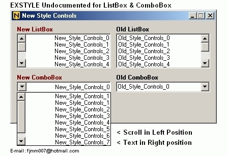

<div align="center">

## EXSTYLE UNDOCUMENTED \- New Style Controls


</div>

### Description

NEW STYLE CONTROLS BY EXSTYLE

EXSTYLE UNDOCUMENTED - ListBox and ComboBox

A new way to present ComboBox and ListBox

Scroll In Left Position and Text In Right Position

This is a new form of presenting ComboBox and ListBox, giving some possibilities the more of symmetry for elements of programs.

To 6 years as programmer, sought a form always of having this symmetry, to make things that I consider they could be better this way, visually speaking.
 
### More Info
 
Scroll In Left Position and Text In Right Position of a ListBox and ComboBox

Any care


<span>             |<span>
---                |---
**Submitted On**   |2007-09-16 15:58:36
**By**             |[Fernando Macedo](https://github.com/Planet-Source-Code/PSCIndex/blob/master/ByAuthor/fernando-macedo.md)
**Level**          |Advanced
**User Rating**    |4.0 (8 globes from 2 users)
**Compatibility**  |VB 6\.0
**Category**       |[Coding Standards](https://github.com/Planet-Source-Code/PSCIndex/blob/master/ByCategory/coding-standards__1-43.md)
**World**          |[Visual Basic](https://github.com/Planet-Source-Code/PSCIndex/blob/master/ByWorld/visual-basic.md)
**Archive File**   |[EXSTYLE\_UN2083579172007\.zip](https://github.com/Planet-Source-Code/fernando-macedo-exstyle-undocumented-new-style-controls__1-69341/archive/master.zip)

### API Declarations

```
GetWindowLong
SetWindowLong
GWL_EXSTYLE
```


